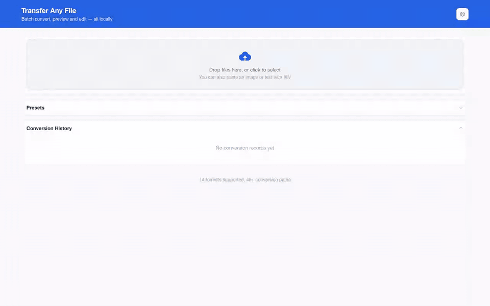
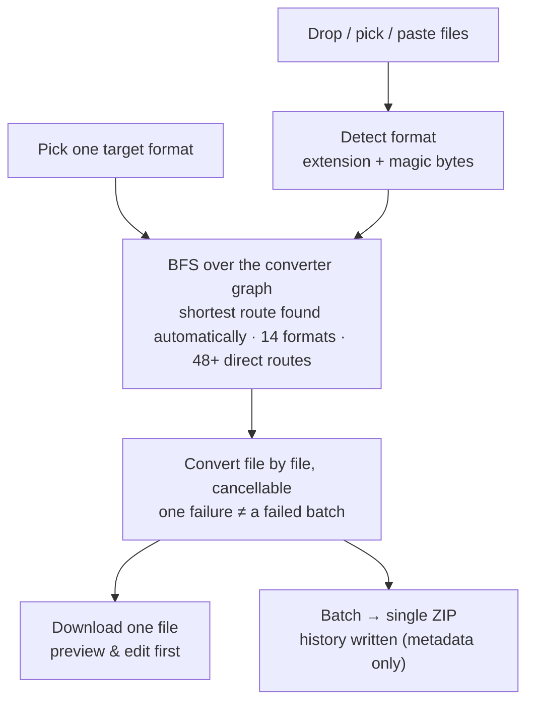

<div align="center">
  

# Transfer Any File

**Convert 14 file formats — Markdown, Word, PDF, Excel, CSV, JSON, HTML, images — without uploading a byte.**

A Chrome extension (Manifest V3) that does every conversion inside a tab on your own machine. No server, no account, no queue, no file ever leaving your laptop.

[简体中文](README.md) · English

  <!-- Badges and links point at github.com/liaolongdong/transfer-any-file and at the GitHub
       Pages site built from docs/ by .github/workflows/static.yml. -->

[](https://github.com/liaolongdong/transfer-any-file/stargazers)

[](https://developer.chrome.com/docs/extensions/get-started)
&nbsp;

&nbsp;

&nbsp;

&nbsp;

&nbsp;


<!-- CWS badges (replace ITEM_ID with the 32-char item ID from Chrome Web Store after publishing):
[](https://chrome.google.com/webstore/detail/ITEM_ID)
[](https://chrome.google.com/webstore/detail/ITEM_ID)
[](https://chrome.google.com/webstore/detail/ITEM_ID) -->

[Core advantages](#-core-advantages) · [In action](#-in-action) · [How it works](#-how-it-works) · [Supported formats](#-supported-conversions) · [How it compares](#-how-it-compares) · [Feature overview](#-feature-overview) · [Privacy](#-privacy) · [Installation and usage](#-installation-and-usage) · [FAQ](#-faq) · [Contributing](#-contributing) · [Contact](#-contact) · [Product page](https://liaolongdong.github.io/transfer-any-file/)

</div>

<p align="center">
  <a href="docs/assets/demo/demo-en.gif"></a>
  <br />
  <sub>One mixed batch end to end: drop in 3 files → pick HTML → convert once → download each or take the ZIP. It all happens on your own machine, with no network request.</sub>
</p>

---

## ✨ Core advantages

Most "free online converter" sites ask you to upload the file first. That is fine for a public dataset and unacceptable for an HR spreadsheet, a client contract, a medical report, or a draft you have not told anyone about yet — and they add an account wall, a daily quota and a size cap on top of the upload round-trip. Transfer Any File keeps the whole job local: a 3 MB Word file becomes Markdown without a single packet leaving the machine.

| Advantage                                              | What makes it different from the alternatives                                                                                                                                                                  |
| ------------------------------------------------------ | -------------------------------------------------------------------------------------------------------------------------------------------------------------------------------------------------------------- |
| 🔌 **Zero uploads, and that is checkable**             | No first-party source file issues a request (`pnpm verify:offline` asserts it) and the manifest asks for `storage` only. Not a "we delete it in 24 hours" promise — there is never a copy to delete            |
| 🧭 **48 edges + BFS pathfinding, chains in one click** | Markdown → HTML → PDF and Word → HTML → Markdown are discovered by the graph, not hard-coded; a new converter is about 20 lines and instantly unlocks every route through it                                   |
| 📦 **Mixed-format batches that cannot cascade**        | 40 different file types share one target with per-file error isolation; failures expand into a diagnostic and copy out as issue-ready text. 200 files per batch, 100 MB per file                               |
| 👀 **Look at it and edit it before downloading**       | Built-in split view (draggable divider, sync scrolling) plus inline editing and one-click copy — no "download first, then open an editor"                                                                      |
| 🖼️ **Image output parameters and presets**             | Longest edge, encoder quality, a file-size ceiling and PDF render density are all adjustable and savable as one-click presets (up to 12). "Compress my image" on the web means another site and another upload |
| 🇨🇳 **Chinese encoding handled**                        | CSV reads UTF-8 with a GB18030 → GBK fallback and writes UTF-8 with BOM, **so Excel opens it without mojibake**; the UI is bilingual                                                                           |
| ♿ **Accessibility you can measure**                   | The end-to-end suite asserts WCAG contrast across 6 themes × light/dark (12 combinations) and asserts the skip link and visible focus ring — a regression turns CI red rather than a design note               |

**Who it fits**

- 🗂️ **Anyone handling sensitive files** — HR, legal, finance, medical: files staying on the machine is a mechanism, not a promise
- ✍️ **Writers** — Markdown ⇄ Word ⇄ HTML ⇄ PDF both ways, so a draft never has to be uploaded to see how it lays out
- 📊 **Data work** — CSV ⇄ Excel ⇄ JSON, every worksheet exported, no mojibake in Excel
- 🎨 **Front-end and design** — six image formats interconverted, with longest edge / quality / size ceiling and presets in one screen
- ✈️ **Offline and air-gapped machines** — airplane mode, disconnected laptops and intranet boxes behave identically

## 🖼️ In action

<p align="center">
  <a href="docs/assets/screenshots/preview-edit.png"></a>
  <br />
  <sub>Markdown source on the left, the HTML it converted to on the right — look at it and edit it before downloading. Every screenshot opens at full size when clicked.</sub>
</p>

<p align="center">
  <a href="docs/assets/screenshots/workbench-empty.png"></a>
  <a href="docs/assets/screenshots/batch-files.png"></a>
  <br />
  <sub><b>Left: drop, pick a format, convert on your own machine</b> (the footer derives the format and route counts) ｜ <b>Right: Markdown, CSV and Excel in one run</b> (each file resolves its own route to the shared target)</sub>
</p>

<p align="center">
  <a href="docs/assets/screenshots/batch-results.png"></a>
  <a href="docs/assets/screenshots/output-preset.png"></a>
  <br />
  <sub><b>Left: one mixed batch, one ZIP download</b> (per-file results, each with its own preview and copy button) ｜ <b>Right: size, quality and a size ceiling saved as a one-click preset</b></sub>
</p>

<p align="center">
  <a href="docs/assets/screenshots/history.png"></a>
  <a href="docs/assets/screenshots/dark-mode.png"></a>
  <br />
  <sub><b>Left: searchable, filterable history with one-click reuse</b> (metadata only, never file contents) ｜ <b>Right: 6 accent colours, light / dark / system</b></sub>
</p>

## 🧭 How it works



Because every conversion pair registers itself as an edge, multi-step chains are discovered rather than hard-coded: Markdown → HTML → PDF, or Word → HTML → Markdown, run as one click. Adding a converter is 20 lines and instantly unlocks every route through it.

## 📚 Supported conversions

| Category  | From                                   | To                                                                                                      |
| --------- | -------------------------------------- | ------------------------------------------------------------------------------------------------------- |
| Documents | Markdown, HTML, Word (.docx), PDF, TXT | Each other via the HTML hub (e.g. MD → DOCX, PDF → MD, TXT → PDF); PDF also rasterizes to PNG/JPEG/WebP |
| Data      | CSV ⇄ Excel (.xlsx), JSON              | Each other and the document cluster via HTML/CSV bridges                                                |
| Images    | PNG, JPEG, WebP, BMP, GIF, SVG         | PNG, JPEG, WebP (GIF renders its first frame; SVG is rasterized)                                        |

**Common routes.**

_One step_

- **Documents** — Markdown ⇄ HTML, Word ⇄ HTML, HTML ⇄ PDF, HTML → TXT, TXT → HTML / Markdown
- **Data** — CSV ⇄ Excel, JSON ⇄ CSV, JSON ⇄ HTML, Excel → JSON, CSV / Excel → HTML
- **Images** — PNG ⇄ JPEG, PNG ⇄ WebP, JPEG ⇄ WebP; BMP / GIF / SVG → PNG / JPEG / WebP; PNG / JPEG / WebP / BMP / GIF → PDF; PDF → PNG / JPEG / WebP; HTML → PNG

_Two or three steps through the HTML hub (still one click, and the picker shows the chain it resolved)_

Word → PDF, PDF → Word, Word ⇄ Markdown, Markdown → PDF, Markdown → Word, PDF → Markdown, PDF → TXT, CSV → PDF, JSON → Excel, Excel → PDF, HTML → Excel, SVG → PDF, and any of the six image formats → Word or Markdown.

_Reachable in the graph but meaningless, so greyed out with the reason instead of failing later_

Image → TXT / CSV / JSON / Excel (that needs OCR, which this offline extension does not bundle), PDF → CSV / JSON / Excel (tabular structure cannot be recovered reliably).

> Notes: PDF output is rendered as images (there is no text layer — the "text" is pixels). PDF input extracts text only (layout and images are not preserved). PDF → image renders each page, and a multi-page document downloads as a ZIP of per-page images in the chosen format (PNG / JPEG / WebP). BMP, GIF and SVG are input-only — browsers cannot encode them, and a GIF converted to an image or a PDF keeps only its first frame, which the result card says too. An inline SVG in Markdown, or an SVG converted to Word or Markdown, is rasterized into an embedded PNG — the drawing survives, but it is a bitmap, not a vector, and the result card says so too. Multi-sheet XLSX → CSV downloads a ZIP with one CSV per worksheet. How the three groups above count up: the 48 registered routes make 143 source→target combinations reachable through BFS, 27 of them are blocked as semantically invalid (24 image → TXT / CSV / JSON / XLSX, 3 PDF → CSV / JSON / XLSX), so the target picker offers 116.

## 🆚 How it compares

Ordered by what should actually decide your choice: the first eight rows are where this extension beats online converters outright (against a CLI it is a split), the last three are where it plainly hands the ground to them or to a command-line tool.

| Dimension                         | ⭐ **Transfer Any File**                                                    | Online converter                       | CLI tool                                                              |
| --------------------------------- | :-------------------------------------------------------------------------- | -------------------------------------- | --------------------------------------------------------------------- |
| Your file leaves the device       | **✅ Never, and the first-party source is checkable**                       | ❌ Always (that is the mechanism)      | ✅ Never                                                              |
| Works offline / on a plane        | **✅ Yes**                                                                  | ❌ No                                  | ✅ Yes                                                                |
| Price and account                 | **✅ Free, no sign-up, no paid tier**                                       | ⚠️ Free quota, a subscription lifts it | ✅ Usually free                                                       |
| Preview and tweak the result      | **✅ Split view + inline editing + copy**                                   | ❌ Usually a thumbnail at best         | ❌ None                                                               |
| Batch of mixed formats            | **✅ One target for the batch, per-file error isolation**                   | ⚠️ Usually paid or queue-bound         | ✅ Yes, and scriptable                                                |
| Size and count limits             | **✅ 100 MB per file, 200 files per batch**                                 | ❌ Daily quotas, size caps, watermarks | ✅ None                                                               |
| Chinese interface and encoding    | **✅ Bilingual UI; CSV written with a UTF-8 BOM so Excel opens it cleanly** | ⚠️ Depends on the service              | ⚠️ Encoding is left to you                                            |
| Source code                       | **✅ Open source (MIT)**                                                    | ❌ Closed                              | ✅ Open source                                                        |
| Setup cost                        | ⚠️ Build once, load the unpacked folder                                     | ✅ None, it is a web page              | ⚠️ Package manager and PATH                                           |
| Format breadth                    | ⚠️ 14 document / data / image formats                                       | ✅ Hundreds, including video and audio | ✅ Pandoc 40+ document formats, ImageMagick hundreds of image formats |
| OCR and complex PDF layout repair | ❌ Not bundled (it would break the offline guarantee)                       | ⚠️ Commonly offered                    | ⚠️ Requires a separate Tesseract install                              |

**When you should not pick it.** Audio or video, or any format a browser cannot decode; thousands of files to script through; image → text. Those are online-service or CLI jobs, and this extension is not a substitute for either.

Summarised from the typical behaviour of each class of tool rather than one specific vendor; Pandoc and ImageMagick stand in for the command-line column.

## 📋 Feature overview

### 📦 Batch and scale

- **Mixed-format batches** — drop 40 files of different types; each resolves its own route to the shared target, and only formats reachable from _every_ selected file are offered
- **Per-file error isolation** — one broken file never blocks the batch; failures are listed with their reason, and each one expands to show the diagnostic (the conversion path and the step that failed) and copies out as plain text, ready to paste into an issue
- **Drop anywhere on the page** — the upload zone is not the only target; releasing files anywhere adds them to the batch. While a conversion is running the drop is ignored and the cursor shows "not allowed"
- **ZIP download with per-entry compression** — text results (TXT / CSV / JSON / HTML / Markdown) are deflated and come out roughly 10× smaller, while already-compressed targets (PNG / JPEG / PDF / XLSX / DOCX) are stored as-is so no CPU is spent for no gain
- **Archive intake** — drop a `.zip` and its supported files are extracted into the batch automatically
- **Multi-sheet and multi-page aware** — XLSX → CSV exports every worksheet; PDF → image exports every page
- **Size guards at the boundary** — warns above 20 MB, rejects above 100 MB per file, caps a batch at 200 files

### 👀 Preview and edit

- **Split view** — source and result side by side with a draggable divider, plus Source-only / Result-only modes and sync scrolling; <kbd>1</kbd> / <kbd>2</kbd> / <kbd>3</kbd> switch between the three modes and <kbd>←</kbd> / <kbd>→</kbd> nudge the divider by 5%
- **Inline editing** — text results (Markdown / HTML / TXT / CSV / JSON) can be corrected before you download them
- **Copy to clipboard** — text results copy out with one click, so a conversion does not have to round-trip through a download
- **Paste to convert** — <kbd>⌘V</kbd> / <kbd>Ctrl+V</kbd> drops in a clipboard image or text snippet
- **Encoding-aware CSV** — reads UTF-8 with a GB18030 → GBK fallback, writes UTF-8 with BOM so Excel opens it without mojibake

### 🎛️ Control and recovery

- **Undo** — restore the previous batch of results in one click; the snapshot is dropped when you change the selected files or the target format
- **Confirm before big batches** — a summary dialog once a batch exceeds 5 files or 20 MB (fixed thresholds), switchable off in Preferences or from the dialog's own **Don't ask again** box
- **Custom shortcuts** — <kbd>Ctrl/⌘</kbd> + <kbd>Enter</kbd> starts a conversion and is rebindable; reserved browser combos (<kbd>Ctrl+T/W/N/L</kbd>, <kbd>Tab</kbd>, <kbd>Esc</kbd>, …) are rejected
- **Completion notifications** — optional desktop notification when a batch finishes while the tab is in the background, built on the web `Notification` API so no extra permission is needed
- **Cancellation** — a long batch can be stopped mid-run; finished files are kept, and the result panel says the batch was cancelled rather than showing it as a failure
- **Image output parameters** — when the target is PNG / JPEG / WebP, cap the longest edge, pick an encoder quality, set a best-effort file-size ceiling, and choose the render density a PDF source is rasterized at. Every one is opt-in: with nothing set the encoders run exactly as they did before. On a multi-step route the geometric settings apply at every step while quality and size apply only to the file you download — chasing a size ceiling through an intermediate encode would just throw away detail the last step would have needed

### 🕘 History and personalization

- **Conversion history** — the last 50 conversions (metadata only) with one-click "reuse this format", search by file name, filter by source/target format, per-record delete, a size-trend sparkline, and JSON export/import (merged by record ID). A multi-file batch is labelled `"<first file> +N"`; new records also keep the full file list, so every file in the batch is searchable and all of them show on hover. Records saved by earlier versions can only match that label. Deleting one record, or clearing all of them, can be undone for the next 5 seconds from the **Undo** button in the toast
- **Recently used targets** — the target dropdown leads with a "recently used" group holding up to 6 of the formats you convert to most often, kept only while they remain selectable for the current source; everything else stays in the document / image / data groups
- **Conversion presets** — save a target format together with its image output parameters as a one-click card (up to 12), and one click restores both. Unlike "recently used", which only remembers a format, a preset remembers the whole recipe — "JPEG, 1280 px, under 200 KB". A preset chosen before any file is added is remembered and applied to the next batch that can take it; one the current batch cannot reach is refused with a reason. An untitled preset names itself after what it does
- **Remembered UI state** — the split-view divider position and the collapsed/expanded state of the history and preset cards are persisted and restored the next time the workbench opens
- **Keyboard and screen reader accessible** — skip link to the main content, visible focus rings, and full `prefers-reduced-motion` support; conversion progress, result counts and the file list's load/clear all land in a `role="status"` region, and the comparison view's divider exposes `role="separator"` with its current ratio
- **Measured contrast** — the end-to-end suite asserts four WCAG contrast pairs (topbar text, focus ring, the primary button label in its rest / hover / pressed states, and informational text) across all 6 themes × light/dark, 12 combinations, and separately asserts that the first Tab lands on the skip link with a visible ring; thresholds, measured readings and the known limitation live in [CONTRIBUTING.en.md](CONTRIBUTING.en.md#accessibility-and-contrast-assertions) · [简体中文](CONTRIBUTING.md#无障碍与对比度断言)
- **Personalization** — 6 theme colors × light / dark / system, Chinese/English interface

## 🔒 Privacy

- All conversions run **100% locally** in the extension page — the load-bearing fact is that no first-party source file issues a request (`fetch`, `XMLHttpRequest`, `WebSocket`, `EventSource` and `sendBeacon` appear nowhere in `entrypoints/`, `components/`, `composables/` or `utils/`, asserted by `pnpm verify:offline`). On top of that, the manifest declares no host permissions and registers no content scripts, so the request paths sitting unused inside third-party converter libraries can neither read a response nor reach any site's data
- The only permission requested is `storage`, used for history (file names, formats, sizes — never contents) and preferences
- No analytics, no tracking, no account, no ads, no paid tier
- Full text: [privacy policy (online, bilingual)](https://liaolongdong.github.io/transfer-any-file/privacy.html) (repository source `docs/privacy.html`) · store-facing answers: [`CHROMEWEBSTORE.md`](CHROMEWEBSTORE.md)

## 📥 Installation and usage

### Install

```bash
# Requirements: Node.js 20.12+ (WXT needs util.parseEnv) and pnpm
pnpm install
pnpm build
```

Then in Chrome:

1. Open `chrome://extensions`
2. Enable **Developer mode** (top right)
3. Click **Load unpacked** and select `.output/chrome-mv3`
4. Click the toolbar icon — the workbench opens in a new tab

There is no store listing yet; `CHROMEWEBSTORE.md` holds the publish-ready listing copy, graphics and disclosure answers for when there is.

### Usage

1. Click the extension icon — the conversion workbench opens in a new tab
2. Drop files anywhere on the page (no need to hit the upload zone), click to select, or paste from the clipboard
3. Pick a target format — only formats reachable from _all_ selected files are offered, and a multi-step conversion shows the path it will take (e.g. `MD → HTML → PDF`)
4. Converting to an image? Set the **output parameters** that appeared under the picker — longest edge, quality, a size ceiling, PDF render density — or leave every one alone for the encoder's own defaults
5. Click **Convert**, then download a single file or the whole batch as a ZIP
6. Do this often? Save the format plus its parameters as a **preset** in the preset card and one click restores the whole recipe next time
7. Open **Preferences** (top right) to switch theme / language / dark mode, toggle completion notifications and the large-batch confirmation, or rebind the convert shortcut

## ❓ FAQ

**Does any part of my file get uploaded?**
No. The converters are JavaScript bundled into the extension, and the manifest requests only `storage`. There is no server to upload to and no first-party code that calls a request API; with no host permission and no content script, the request paths left unused inside those libraries cannot read a response either.

**Can it convert PDF to editable Word or Excel?**
Not losslessly. PDF input extracts text, and PDF output is rendered page-by-page as images, so converted PDFs carry no text layer. Word and Excel go through HTML as the hub format.

**Why can't I turn a screenshot into a text file?**
That requires OCR, and no OCR engine is bundled — it would add tens of megabytes and a model download, which the offline guarantee rules out. Image → TXT/CSV is greyed out with that reason instead of failing later.

**I converted an image to PDF and could still select and copy text — how?**
That is the PDF viewer talking, not this extension. The PDF we write is a page image: it has no text layer and no real characters in it. Some viewers recognise the text on a page as they display it, so the characters you copied came from the viewer, and the recognition result is not stored in the file either. This extension bundles no OCR and can neither read nor write those characters, which is why image → TXT / CSV stays greyed out. When a batch contains a PDF, the result card says the same thing.

**Does it work without internet?**
Yes. Once installed the UI and every converter run locally, and the text is set in system fonts rather than a downloaded webfont, so nothing has to be fetched; airplane mode changes nothing.

**How is this different from an online converter?**
Same job, opposite direction: online tools ship your file to a machine you don't control and delete it "within 24 hours"; this one never has a copy to delete. The trade-off is breadth — online tools cover hundreds of formats including video and audio, this one covers 14 document, data and image formats that browsers can decode.

**Is there a file-size or batch limit?**
100 MB per file (warned at 20 MB), 200 files per batch, and a confirmation dialog above 5 files or 20 MB total.

**Is it free?**
Yes. The project is MIT-licensed, with no account, no paid tier, no advertising and no upsell — no feature is gated behind anything.

**Which browsers does it run in?**
The build produces a Chrome Manifest V3 package, which also loads in Edge, Brave and other Chromium browsers. There is no Firefox build in this repository.

**Where is the conversion history kept, and how do I clear it?**
In `chrome.storage.local` on your own machine, holding file names, formats and sizes only — never file contents. The history panel can delete a single record, clear everything, and export or import the list as JSON. A mistake is recoverable: after either delete action the toast offers **Undo** for 5 seconds. Removing the extension removes that local storage with it, because there is no copy anywhere else.

## 🤝 Contributing

1. Fork, branch off `main`, and run `pnpm install && pnpm dev`
2. Keep it offline: no new permission, no network call, no remote asset — say so in the PR if a change needs one
3. Run `pnpm lint:all` and `pnpm test:e2e`, and add a fixture + scenario for any new converter

The full rule set lives in [CONTRIBUTING.en.md](CONTRIBUTING.en.md) · [简体中文](CONTRIBUTING.md): the command list, tech stack, project structure, the five steps for adding a converter, coding and documentation-sync conventions, the two icon masters, and the accessibility contrast thresholds with their measured values. Report security issues privately, not as an issue: [SECURITY.en.md](SECURITY.en.md) · [简体中文](SECURITY.md).

## 📮 Contact

<div align="center">
  
  <br />
  <sub>Scan to add the author on WeChat — note `taf` and you are in the plugin group</sub>
</div>

- **WeChat**: `lld_1025`, note `taf` (for Transfer Any File) — bug reports, format requests and pre-release trials happen in the group
- **Email**: [924902324@qq.com](mailto:924902324@qq.com?subject=Transfer%20Any%20File%20feedback) — the same address published in `package.json#author.email` and on the store listing
- **Issues**: [bugs and format requests](https://github.com/liaolongdong/transfer-any-file/issues) — the searchable channel comes first, and whatever the group concludes gets written back here
- **About this code**: it is a personal-add QR, not a group invite, so it does not expire after 7 days the way group codes do. Its master copy lives in the author's other repository, [account-password-helper](https://github.com/liaolongdong/account-password-helper); if it changes there, this copy has to be re-pulled

Security issues go through the private channel in [SECURITY.en.md](SECURITY.en.md) above.

## 📄 License

[MIT](LICENSE) — release history in [CHANGELOG.en.md](CHANGELOG.en.md) · [简体中文](CHANGELOG.md)

---

<div align="center">

**If this saves you from uploading a sensitive file one more time, a star helps the next person find it.**

[](https://github.com/liaolongdong/transfer-any-file/stargazers)

Authored by [Better](https://github.com/liaolongdong).

**Two more fully offline extensions by the same author** (data stays on your machine, open source under MIT):

- ★ Featured · [Account Password Helper](https://github.com/liaolongdong/account-password-helper) — Ctrl+Shift+F one-click login, exact domain matching isolates dev/test/staging/prod accounts, built-in TOTP, local AES-256-GCM encryption · [product page](https://liaolongdong.github.io/account-password-helper/)
- [Cross-origin Proxy](https://github.com/liaolongdong/cross-origin-proxy) — proxy a page's API requests to another backend environment: rewrite URLs, headers and responses, conditional mocks, injected delays, WebSocket forwarding · [product page](https://liaolongdong.github.io/cross-origin-proxy/)

</div>
