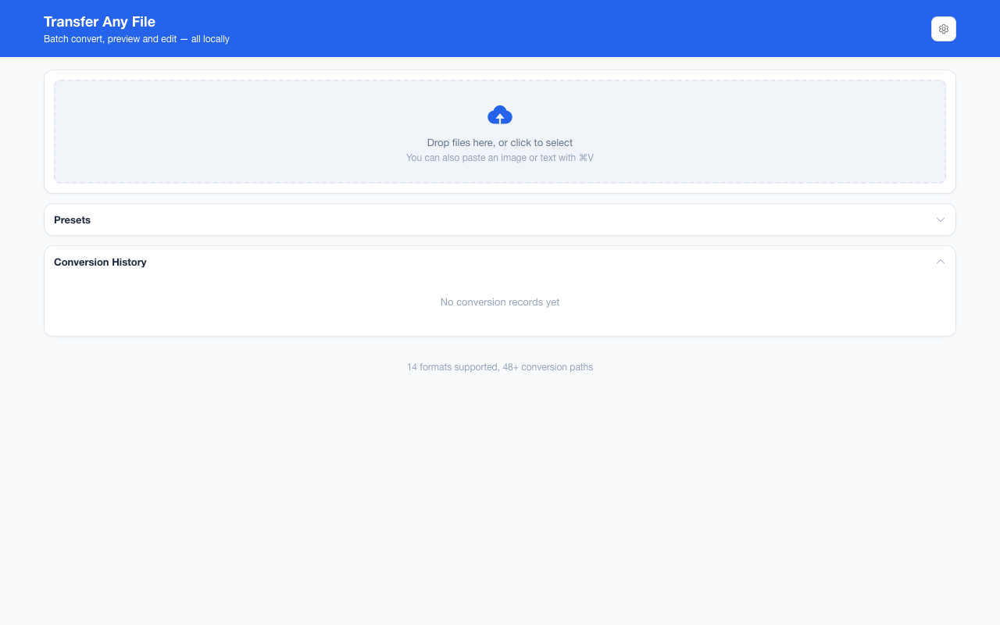
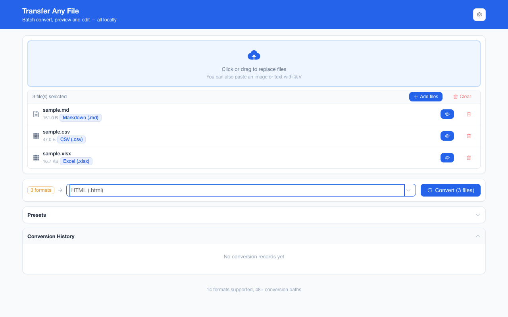
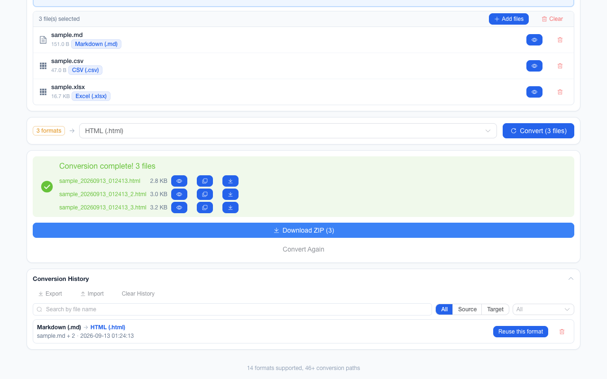
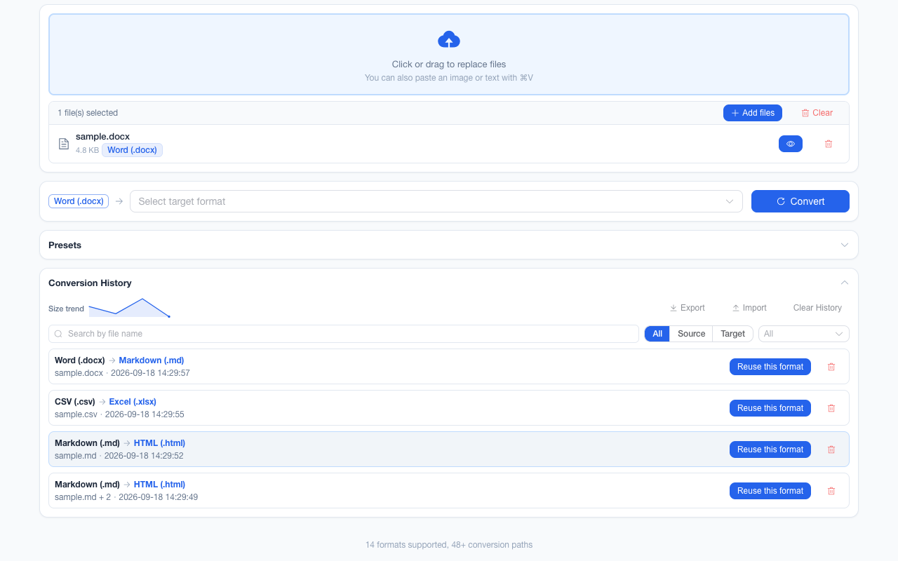
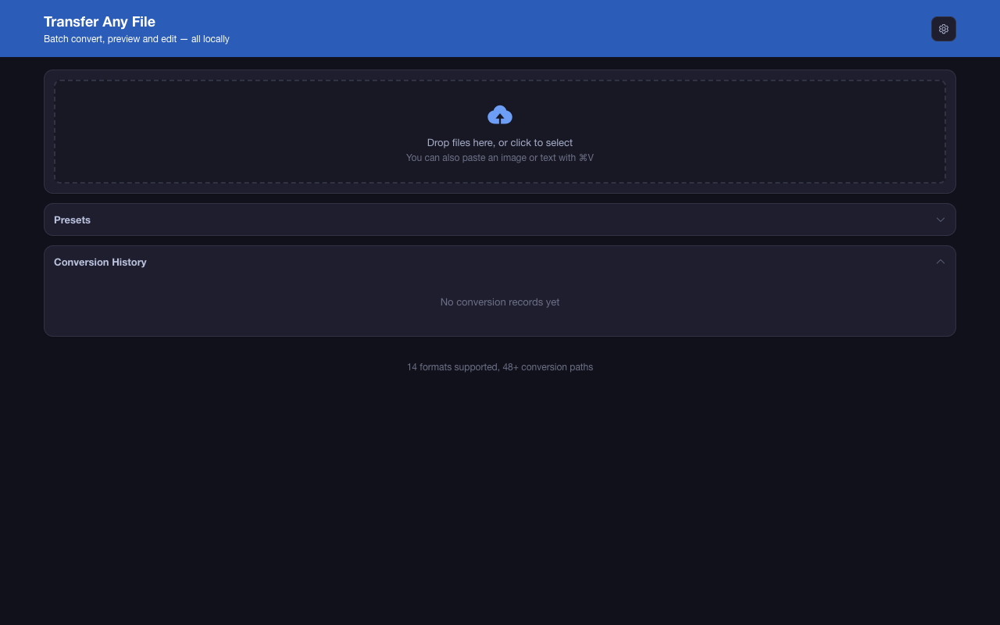

<div align="center">
  

# Transfer Any File

**Convert 14 file formats — Markdown, Word, PDF, Excel, CSV, JSON, HTML, images — without uploading a byte.**

A Chrome extension (Manifest V3) that does every conversion inside a tab on your own machine. No server, no account, no queue, no file ever leaving your laptop.

[简体中文](README.zh-CN.md) · English

  <!-- Badges and links point at github.com/liaolongdong/transfer-any-file and at the GitHub
       Pages site built from docs/ by .github/workflows/static.yml. -->

[](https://github.com/liaolongdong/transfer-any-file/stargazers)

[](https://developer.chrome.com/docs/extensions/get-started)
&nbsp;

&nbsp;

&nbsp;

&nbsp;

&nbsp;


[Screenshots](#screenshots) · [Why this exists](#why-this-exists) · [Quick start](#quick-start) · [How it works](#how-it-works) · [Supported formats](#supported-conversions) · [How it compares](#how-it-compares) · [Privacy](#privacy) · [FAQ](#faq) · [Contributing](#contributing) · [Product page](https://liaolongdong.github.io/transfer-any-file/)

</div>


---

## Screenshots

<p align="center">
  
  <br />
  <sub><b>Drop, pick a format, convert on your own machine</b> — the empty workbench, with the format and route counts the footer derives.</sub>
</p>

<p align="center">
  
  <br />
  <sub><b>Batch: Markdown, CSV and Excel in one run</b> — each file resolves its own route to the shared target.</sub>
</p>

<p align="center">
  
  <br />
  <sub><b>One mixed batch, one ZIP download</b> — per-file results, each with its own preview and copy button.</sub>
</p>

<p align="center">
  
  <br />
  <sub><b>Preview side by side, edit before you download</b> — the split view with its Rendered / Source / Edit / Copy controls.</sub>
</p>

<p align="center">
  
  <br />
  <sub><b>Searchable, filterable history with one-click reuse</b> — metadata only, never file contents.</sub>
</p>

<p align="center">
  
  <br />
  <sub><b>6 accent colours, light / dark / system</b> — the same workbench with the dark appearance applied at startup.</sub>
</p>

## Why this exists

Most "free online converter" sites ask you to upload the file first. That is fine for a public dataset and unacceptable for an HR spreadsheet, a client contract, a medical report, or a draft you have not told anyone about yet. They also add an account wall, a daily quota and a size cap, and make you pay an upload round-trip for something your own laptop can finish without a network.

Transfer Any File keeps the whole job local. The converters run in the extension page, so a 3 MB Word file becomes Markdown without a single packet leaving the machine — and it still works on a plane.

## Quick start

```bash
# Requirements: Node.js 20.12+ (WXT needs util.parseEnv) and pnpm
pnpm install
pnpm build
```

Then in Chrome:

1. Open `chrome://extensions`
2. Enable **Developer mode** (top right)
3. Click **Load unpacked** and select `.output/chrome-mv3`
4. Click the toolbar icon — the workbench opens in a new tab

There is no store listing yet; `CHROMEWEBSTORE.md` holds the publish-ready listing copy, graphics and disclosure answers for when there is.

## How it works

```
drop / pick / paste files          pick one target format
        │                                  │
        ▼                                  ▼
  detect format  ──────►  BFS over the converter graph  ◄── finds the shortest route
  (extension +            14 formats · 46+ direct routes
   magic bytes)                      │
                                     ▼
                     convert file-by-file, cancellable
                     one failure ≠ a failed batch
                                     │
                     ┌───────────────┴───────────────┐
                     ▼                               ▼
              download one file              batch → single ZIP
              preview & edit first           history written (metadata only)
```

Because every conversion pair registers itself as an edge, multi-step chains are discovered rather than hard-coded: Markdown → HTML → PDF, or Word → HTML → Markdown, run as one click. Adding a converter is 20 lines and instantly unlocks every route through it.

## Supported conversions

| Category  | From                                   | To                                                                                                      |
| --------- | -------------------------------------- | ------------------------------------------------------------------------------------------------------- |
| Documents | Markdown, HTML, Word (.docx), PDF, TXT | Each other via the HTML hub (e.g. MD → DOCX, PDF → MD, TXT → PDF); PDF also rasterizes to PNG/JPEG/WebP |
| Data      | CSV ⇄ Excel (.xlsx), JSON              | Each other and the document cluster via HTML/CSV bridges                                                |
| Images    | PNG, JPEG, WebP, BMP, GIF, SVG         | PNG, JPEG, WebP (GIF renders its first frame; SVG is rasterized)                                        |

**Common routes.** Direct: Markdown ⇄ HTML, Word ⇄ HTML, HTML ⇄ PDF, CSV ⇄ Excel, JSON ⇄ CSV, JSON ⇄ HTML, Excel → JSON, CSV → HTML, Excel → HTML, TXT → HTML, TXT → Markdown, HTML → TXT, HTML → PNG, PNG ⇄ JPEG, PNG ⇄ WebP, JPEG ⇄ WebP, BMP → PNG / JPEG / WebP, GIF → PNG / JPEG / WebP, SVG → PNG / JPEG / WebP, PNG → PDF, JPEG → PDF, WebP → PDF, BMP → PDF, GIF → PDF, PDF → PNG. Through the HTML hub, in two or three steps: Word → PDF, PDF → Word, Word ⇄ Markdown, Markdown → PDF, Markdown → Word, PDF → Markdown, PDF → HTML → TXT, CSV → PDF, JSON → Excel, Excel → PDF, HTML → Excel, SVG → PDF, and any of the six image formats → Word or Markdown. The target picker shows the resolved chain, so a multi-step route is no extra work — and the formats that BFS reaches but cannot mean anything (image → TXT / CSV / JSON / Excel, PDF → CSV / JSON / Excel) are greyed out with the reason instead of failing later.

> Notes: PDF output is rendered as images (text is not selectable). PDF input extracts text only (layout and images are not preserved). PDF → image renders each page; multi-page documents download as a ZIP of per-page PNGs. BMP, GIF and SVG are input-only — browsers cannot encode them. Multi-sheet XLSX → CSV downloads a ZIP with one CSV per worksheet. The target dropdown lists every format and greys out unavailable ones with a reason: of the 143 source→target combinations BFS finds reachable over the 46 registered routes, 27 are blocked as semantically invalid — images cannot become text or tabular data (that needs OCR, which this offline extension does not bundle), and PDF cannot be reliably converted to tabular/structured data — so 116 are actually offered.

## How it compares

| Dimension                         | Transfer Any File                                                             | Online converter                            | CLI tool                                                           |
| --------------------------------- | ----------------------------------------------------------------------------- | ------------------------------------------- | ------------------------------------------------------------------ |
| Your file leaves the device       | Never                                                                         | Always (that is the mechanism)              | Never                                                              |
| Setup cost                        | Build once, load the unpacked folder                                          | None, it is a web page                      | Package manager and PATH                                           |
| Free-tier limits                  | 100 MB per file, 200 files per batch                                          | Daily quotas, size caps, watermarks         | None                                                               |
| Works offline / on a plane        | Yes                                                                           | No                                          | Yes                                                                |
| Batch of mixed formats            | Yes, one target for the whole batch                                           | Usually paid or queue-bound                 | Yes, and scriptable                                                |
| Preview and tweak the result      | Built-in comparison view and inline editing                                   | Usually a thumbnail at best                 | None                                                               |
| Format breadth                    | 14 document / data / image formats                                            | Hundreds, including video and audio         | Pandoc 40+ document formats, ImageMagick hundreds of image formats |
| OCR and complex PDF layout repair | Not bundled                                                                   | Commonly offered                            | Requires a separate Tesseract install                              |
| Price and account                 | Free, no sign-up, no paid tier                                                | Free quota, a subscription lifts the limits | Usually free                                                       |
| Chinese interface and encoding    | Bilingual UI; CSV written with a UTF-8 BOM so Excel opens it without mojibake | Depends on the service                      | Encoding is left to you                                            |
| Source code                       | Open source (ISC)                                                             | Closed                                      | Open source                                                        |

Summarised from the typical behaviour of each class of tool rather than one specific vendor; Pandoc and ImageMagick stand in for the command-line column. The three are not substitutes — online services reach formats a browser cannot decode, and a CLI can be scripted across thousands of files.

## What you can do with it

**Batch and scale**

- **Mixed-format batches** — drop 40 files of different types; each resolves its own route to the shared target, and only formats reachable from _every_ selected file are offered
- **Per-file error isolation** — one broken file never blocks the batch; failures are listed with their reason, and each one expands to show the diagnostic (the conversion path and the step that failed) and copies out as plain text, ready to paste into an issue
- **Drop anywhere on the page** — the upload zone is not the only target; releasing files anywhere adds them to the batch. While a conversion is running the drop is ignored and the cursor shows "not allowed"
- **ZIP download with per-entry compression** — text results (TXT / CSV / JSON / HTML / Markdown) are deflated and come out roughly 10× smaller, while already-compressed targets (PNG / JPEG / PDF / XLSX / DOCX) are stored as-is so no CPU is spent for no gain
- **Archive intake** — drop a `.zip` and its supported files are extracted into the batch automatically
- **Multi-sheet and multi-page aware** — XLSX → CSV exports every worksheet; PDF → image exports every page
- **Size guards at the boundary** — warns above 20 MB, rejects above 100 MB per file, caps a batch at 200 files

**Preview and edit**

- **Split view** — source and result side by side with a draggable divider, plus Source-only / Result-only modes and sync scrolling; <kbd>1</kbd> / <kbd>2</kbd> / <kbd>3</kbd> switch between the three modes and <kbd>←</kbd> / <kbd>→</kbd> nudge the divider by 5%
- **Inline editing** — text results (Markdown / HTML / TXT / CSV / JSON) can be corrected before you download them
- **Copy to clipboard** — text results copy out with one click, so a conversion does not have to round-trip through a download
- **Paste to convert** — <kbd>⌘V</kbd> / <kbd>Ctrl+V</kbd> drops in a clipboard image or text snippet
- **Encoding-aware CSV** — reads UTF-8 with GBK fallback, writes UTF-8 with BOM so Excel opens it without mojibake

**Control and recovery**

- **Undo** — restore the previous batch of results in one click; the snapshot is dropped when you change the selected files or the target format
- **Confirm before big batches** — a summary dialog once a batch exceeds 5 files or 20 MB (fixed thresholds), switchable off in Preferences
- **Custom shortcuts** — <kbd>Ctrl/⌘</kbd> + <kbd>Enter</kbd> starts a conversion and is rebindable; reserved browser combos (<kbd>Ctrl+T/W/N/L</kbd>, <kbd>Tab</kbd>, <kbd>Esc</kbd>, …) are rejected
- **Completion notifications** — optional desktop notification when a batch finishes while the tab is in the background, built on the web `Notification` API so no extra permission is needed
- **Cancellation** — a long batch can be stopped mid-run; finished files are kept

**History and personalization**

- **Conversion history** — the last 50 conversions (metadata only) with one-click "reuse this format", search by file name, filter by source/target format, per-record delete, a size-trend sparkline, and JSON export/import (merged by record ID). A multi-file batch is labelled `"<first file> +N"`; new records also keep the full file list, so every file in the batch is searchable and all of them show on hover. Records saved by earlier versions can only match that label
- **Recently used targets** — the target dropdown leads with a "recently used" group holding up to 6 of the formats you convert to most often, kept only while they remain selectable for the current source; everything else stays in the document / image / data groups
- **Remembered UI state** — the split-view divider position and the collapsed/expanded state of the history card are persisted and restored the next time the workbench opens
- **Keyboard accessible** — skip link to the main content, visible focus rings, and full `prefers-reduced-motion` support
- **Measured contrast** — the end-to-end suite asserts two contrast pairs in all 6 themes × light/dark (12 combinations): topbar brand text on the topbar at 4.5:1 or better (WCAG 2.1 AA for text), and the focus ring on a card at 3:1 or better (AA for user-interface components). It separately asserts that the first Tab lands on the skip link and that the link shows a visible ring. Known limitation: on the light green and orange themes the primary button still sits at 2.5–3.6:1, because no single foreground survives its base/hover/active shades — fixing that means re-deriving the light primary scale, which has not been done
- **Personalization** — 6 theme colors × light / dark / system, Chinese/English interface

## Privacy

- All conversions run **100% locally** in the extension page — the load-bearing fact is that no first-party source file issues a request (`fetch`, `XMLHttpRequest`, `WebSocket`, `EventSource` and `sendBeacon` appear nowhere in `entrypoints/`, `components/`, `composables/` or `utils/`, asserted by `pnpm verify:offline`). On top of that, the manifest declares no host permissions and registers no content scripts, so the request paths sitting unused inside third-party converter libraries can neither read a response nor reach any site's data
- The only permission requested is `storage`, used for history (file names, formats, sizes — never contents) and preferences
- No analytics, no tracking, no account, no ads, no paid tier
- Full text: [`docs/privacy.html`](docs/privacy.html) · store-facing answers: [`CHROMEWEBSTORE.md`](CHROMEWEBSTORE.md)

## Usage

1. Click the extension icon — the conversion workbench opens in a new tab
2. Drop files anywhere on the page (no need to hit the upload zone), click to select, or paste from the clipboard
3. Pick a target format — only formats reachable from _all_ selected files are offered, and a multi-step conversion shows the path it will take (e.g. `MD → HTML → PDF`)
4. Click **Convert**, then download a single file or the whole batch as a ZIP
5. Open **Preferences** (top right) to switch theme / language / dark mode, toggle completion notifications and the large-batch confirmation, or rebind the convert shortcut

## FAQ

**Does any part of my file get uploaded?**
No. The converters are JavaScript bundled into the extension, and the manifest requests only `storage`. There is no server to upload to and no first-party code that calls a request API; with no host permission and no content script, the request paths left unused inside those libraries cannot read a response either.

**Can it convert PDF to editable Word or Excel?**
Not losslessly. PDF input extracts text, and PDF output is rendered page-by-page as images, so converted PDFs are not text-selectable. Word and Excel go through HTML as the hub format.

**Why can't I turn a screenshot into a text file?**
That requires OCR, and no OCR engine is bundled — it would add tens of megabytes and a model download, which the offline guarantee rules out. Image → TXT/CSV is greyed out with that reason instead of failing later.

**Does it work without internet?**
Yes. Once installed the UI and every converter run locally, and the text is set in system fonts rather than a downloaded webfont, so nothing has to be fetched; airplane mode changes nothing.

**How is this different from an online converter?**
Same job, opposite direction: online tools ship your file to a machine you don't control and delete it "within 24 hours"; this one never has a copy to delete. The trade-off is breadth — online tools cover hundreds of formats including video and audio, this one covers 14 document, data and image formats that browsers can decode.

**Is there a file-size or batch limit?**
100 MB per file (warned at 20 MB), 200 files per batch, and a confirmation dialog above 5 files or 20 MB total.

**Is it free?**
Yes. The project is ISC-licensed, with no account, no paid tier, no advertising and no upsell — no feature is gated behind anything.

**Which browsers does it run in?**
The build produces a Chrome Manifest V3 package, which also loads in Edge, Brave and other Chromium browsers. There is no Firefox build in this repository.

**Where is the conversion history kept, and how do I clear it?**
In `chrome.storage.local` on your own machine, holding file names, formats and sizes only — never file contents. The history panel can delete a single record, clear everything, and export or import the list as JSON. Removing the extension removes that local storage with it, because there is no copy anywhere else.

## Development

```bash
pnpm dev              # dev mode with hot reload (WXT)
pnpm build            # production build to .output/chrome-mv3
pnpm package          # zip for distribution
pnpm typecheck        # vue-tsc
pnpm lint:all         # typecheck + eslint + stylelint
pnpm verify:meta      # package.json / wxt.config.ts / .github/repo-metadata.json stay in sync
pnpm verify:offline   # no network call in first-party source, storage-only manifest
pnpm test:e2e         # build + Playwright suite over fixtures/ (159 assertions)
pnpm assets:capture   # regenerate store/README screenshots + promo graphics (needs pnpm build first)
node scripts/render-icons.mjs   # re-render icons from assets/*.svg
git tag v1.0.0 && git push --tags   # release.yml: build the store zip, verify it, open the GitHub Release
```

### Tech stack

- [WXT](https://wxt.dev/) + Vue 3 + TypeScript + Element Plus
- Converters: [marked](https://github.com/markedjs/marked), [turndown](https://github.com/mixmark-io/turndown), [mammoth](https://github.com/mwilliamson/mammoth.js), [html-docx-js-typescript](https://github.com/caiyexiang/html-docx-js-typescript), [jsPDF](https://github.com/parallax/jsPDF) + [html-to-image](https://github.com/bubkoo/html-to-image), [pdf.js](https://mozilla.github.io/pdf.js/), [SheetJS](https://sheetjs.com/), [fflate](https://github.com/101arrowz/fflate), [DOMPurify](https://github.com/cure53/DOMPurify)
- Heavy dependencies are dynamically imported per converter, so the first paint stays small (whole bundle: 3.71 MB)

### Project structure

```
entrypoints/
  background.ts        # opens the workbench on icon click
  options/             # the conversion workbench (Vue app)
components/            # shared UI (upload, format selector, preview, results, history)
composables/           # useConversion / useFileDetect / useHistory / useI18n / useTheme
utils/
  core/                # converter registry (BFS pathfinding), types, format metadata
  converters/          # one module per conversion pair
  i18n/                # zh / en dictionaries
assets/                # icon SVG masters, global styles, theme tokens
docs/                  # product page + privacy policy (GitHub Pages source, not bundled)
  assets/screenshots/  # raw 1280×800 UI shots used by this file and the product page
  assets/store/        # social preview + Chrome Web Store promo tiles
    screens/           # captioned 1280×800 listing screenshots (English and Chinese)
scripts/               # e2e suite, asset capture, icon rendering, metadata + offline guards
.github/
  workflows/           # ci.yml · static.yml (Pages) · release.yml · repo-meta.yml
  ISSUE_TEMPLATE/      # bug report and format request forms
CHROMEWEBSTORE.md      # store listing copy, permissions justification, disclosures
CHANGELOG.md           # release notes (.zh-CN.md twin)
CONTRIBUTING.md        # the whole rule set, in one page (.zh-CN.md twin)
SECURITY.md            # disclosure channel and the offline attack-surface claims (.zh-CN.md twin)
```

`docs/` is repository documentation only — it is never copied into `.output/chrome-mv3`.

### Adding a new converter

1. Create `utils/converters/<from>-to-<to>.ts` implementing the `Converter` interface (`from`, `to`, `convert(blob)`)
2. Register it in `utils/converters/index.ts`
3. If it introduces a new format: extend `FileFormat`, `FORMAT_INFO` and the extension/MIME maps in `composables/useFileDetect.ts`

Multi-step paths through the new format are discovered automatically.

## Contributing

1. Fork, branch off `main`, and run `pnpm install && pnpm dev`
2. Keep it offline: no new permission, no network call, no remote asset — say so in the PR if a change needs one
3. Run `pnpm lint:all` and `pnpm test:e2e`, and add a fixture + scenario for any new converter

Full rule set — adding a converter, conventions, and which docs must move together: [CONTRIBUTING.md](CONTRIBUTING.md) · [中文](CONTRIBUTING.zh-CN.md). Security issues are reported privately, not as issues: [SECURITY.md](SECURITY.md) · [中文](SECURITY.zh-CN.md).

Issues and format requests: [github.com/liaolongdong/transfer-any-file/issues](https://github.com/liaolongdong/transfer-any-file/issues)

## License

[ISC](LICENSE)

---

<div align="center">

**If this saves you from uploading a sensitive file one more time, a star helps the next person find it.**

[](https://github.com/liaolongdong/transfer-any-file/stargazers)

Authored by [Better](https://github.com/liaolongdong).

</div>
