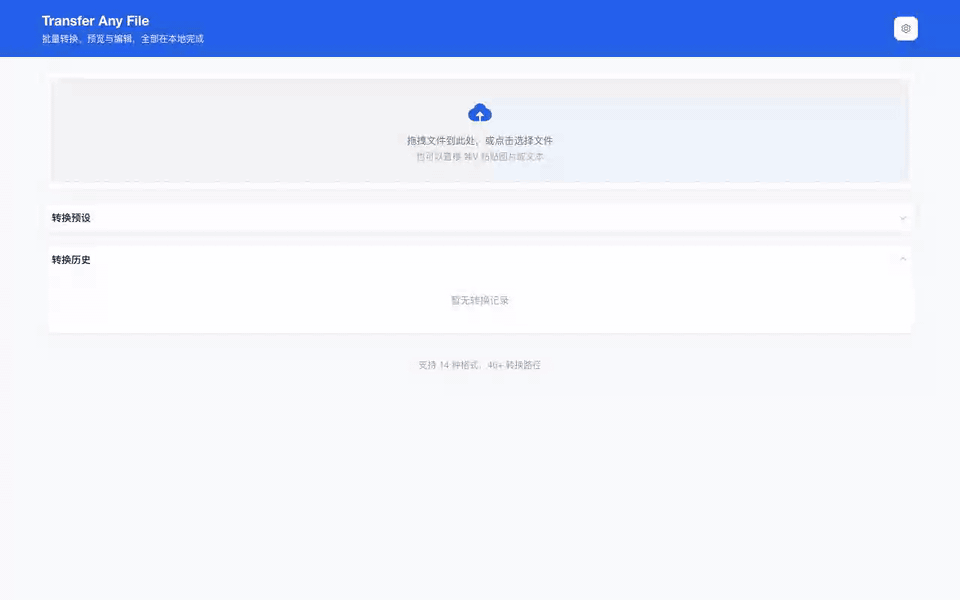
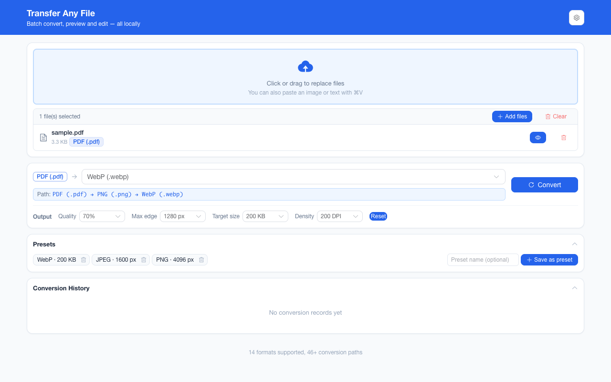
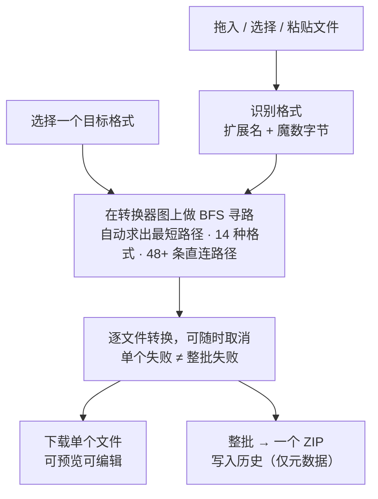

<div align="center">
  

# Transfer Any File

**14 种文件格式互转——Markdown、Word、PDF、Excel、CSV、JSON、HTML、图片——一个字节都不用上传。**

一款 Chrome 扩展（Manifest V3），所有转换都在你自己电脑上的一个标签页里完成。无服务器、无账号、无排队，文件永远不出本机。

简体中文 · [English](README.en.md)

  <!-- 徽章与链接指向 github.com/liaolongdong/transfer-any-file，以及由 .github/workflows/static.yml
       从 docs/ 构建的 GitHub Pages 站点。 -->

[](https://github.com/liaolongdong/transfer-any-file/stargazers)

[](https://developer.chrome.com/docs/extensions/get-started)
&nbsp;

&nbsp;

&nbsp;

&nbsp;

&nbsp;


<!-- CWS badges (replace ITEM_ID with the 32-char item ID from Chrome Web Store after publishing):
[](https://chrome.google.com/webstore/detail/ITEM_ID)
[](https://chrome.google.com/webstore/detail/ITEM_ID)
[](https://chrome.google.com/webstore/detail/ITEM_ID) -->

[核心优势](#-核心优势) · [功能演示](#-功能演示) · [工作原理](#-工作原理) · [支持的格式](#-支持的转换) · [横向对比](#-横向对比) · [功能全览](#-功能全览) · [隐私](#-隐私) · [安装与上手](#-安装与上手) · [常见问题](#-常见问题) · [参与贡献](#-参与贡献) · [联系方式](#-联系方式) · [产品说明页](https://liaolongdong.github.io/transfer-any-file/)

</div>

<p align="center">
  <a href="docs/assets/demo/demo-zh.gif"></a>
  <br />
  <sub>一批混合格式走完一遍：拖入 3 个文件 → 选 HTML → 一次转换 → 逐个下载或打包 ZIP。全部在你自己的电脑上完成，没有一次网络请求。</sub>
</p>

---

## ✨ 核心优势

绝大多数"免费在线转换"网站第一步就是让你上传文件。公开数据集无所谓，但 HR 表格、客户合同、体检报告、还没告诉任何人的草稿就不一样了——它们还附带账号墙、每日额度与体积上限，为了一个你的电脑不联网也能做完的事，白白付出一趟上传往返。Transfer Any File 把整件事留在本地：一个 3 MB 的 Word 文件变成 Markdown，不需要有一个数据包离开你的机器。

| 优势                                        | 与其他工具的差异                                                                                                                                  |
| ------------------------------------------- | ------------------------------------------------------------------------------------------------------------------------------------------------- |
| 🔌 **零上传，而且可验证**                   | 第一方源码中没有任何一处发起请求（`pnpm verify:offline` 断言），manifest 只申请 `storage`。不是"承诺 24 小时内删除"，是**从来没有一份可删的副本** |
| 🧭 **48 条边 + BFS 寻路，多步链路一次点击** | Markdown → HTML → PDF、Word → HTML → Markdown 由图求解而非写死；新增一个转换器约 20 行，它参与的所有路径**立刻自动可用**                          |
| 📦 **混合源格式一次转完，单个失败不拖整批** | 40 个不同类型文件共用一个目标，逐文件错误隔离，失败项可展开诊断并一键复制成 issue 文本；单批 200 个、单文件 100 MB                                |
| 👀 **下载之前先看、先改**                   | 内置左右对照视图（可拖分隔条、同步滚动）+ 文本结果内联编辑 + 一键复制，不必"先下载再开编辑器"                                                     |
| 🖼️ **图片输出参数与预设**                   | 最长边、编码质量、目标体积、PDF 栅格清晰度四项全可调，并存成一键预设（≤ 12 个）；在线工具的"压缩图片"意味着另一站、另一次上传                     |
| 🇨🇳 **中文编码不踩坑**                       | CSV 读取 UTF-8 失败依次回退 GB18030 与 GBK，输出带 UTF-8 BOM，**Excel 打开不乱码**；中英双语界面                                                  |
| ♿ **可测量的无障碍**                       | 端到端套件在 6 主题 × 明暗共 12 组配置下逐项断言 WCAG 对比度，另断言 skip link 与可见焦点环；不是"设计上应该注意"，是 CI 会红                     |

**适合谁**

- 🗂️ **处理敏感文件的人** — HR、法务、财务、医疗：文件不出本机是机制，不是承诺
- ✍️ **写作者** — Markdown ⇄ Word ⇄ HTML ⇄ PDF 双向，草稿不必先上传才能看到排版结果
- 📊 **数据与分析** — CSV ⇄ Excel ⇄ JSON，多工作表全量导出，Excel 打开不乱码
- 🎨 **前端与设计** — 6 种图片格式互转 + 最长边 / 质量 / 目标体积 + 预设，一屏之内完成
- ✈️ **离线与内网环境** — 飞行模式、断网机器、内网隔离环境表现完全一致

## 🖼️ 功能演示

<p align="center">
  <a href="docs/assets/screenshots/preview-edit.png"></a>
  <br />
  <sub>左边是 Markdown 源码，右边是它转出来的 HTML——下载之前先看、先改。本页截图点击均可查看原尺寸。</sub>
</p>

<p align="center">
  <a href="docs/assets/screenshots/workbench-empty.png"></a>
  <a href="docs/assets/screenshots/batch-files.png"></a>
  <br />
  <sub><b>左：拖入、选格式，在你自己电脑上转换</b>（页脚给出格式数与路径数）｜ <b>右：Markdown、CSV、Excel 一次转完</b>（每个文件各自求出到公共目标的路径）</sub>
</p>

<p align="center">
  <a href="docs/assets/screenshots/batch-results.png"></a>
  <a href="docs/assets/screenshots/output-preset.png"></a>
  <br />
  <sub><b>左：一次混合批量，一个 ZIP 下载</b>（逐文件结果，各自带预览与复制按钮）｜ <b>右：尺寸、质量、目标体积存成一键预设</b></sub>
</p>

<p align="center">
  <a href="docs/assets/screenshots/history.png"></a>
  <a href="docs/assets/screenshots/dark-mode.png"></a>
  <br />
  <sub><b>左：历史可搜索、可筛选、一键复用格式</b>（只存元数据，绝不保存文件内容）｜ <b>右：6 种主题色，浅色 / 深色 / 跟随系统</b></sub>
</p>

## 🧭 工作原理



每个转换对都把自己注册成图上的一条边，所以多步链路是"寻路求出来的"而不是写死的：Markdown → HTML → PDF、Word → HTML → Markdown，都是一次点击。新增一个转换器只需约 20 行，它参与的所有路径立刻自动可用。

## 📚 支持的转换

| 类别 | 源格式                                 | 目标格式                                                                                |
| ---- | -------------------------------------- | --------------------------------------------------------------------------------------- |
| 文档 | Markdown、HTML、Word (.docx)、PDF、TXT | 以 HTML 为枢纽互转（如 MD → DOCX、PDF → MD、TXT → PDF）；PDF 还可逐页转为 PNG/JPEG/WebP |
| 数据 | CSV ⇄ Excel (.xlsx)、JSON              | 互相转换，并经 HTML/CSV 桥接进入文档簇                                                  |
| 图片 | PNG、JPEG、WebP、BMP、GIF、SVG         | PNG、JPEG、WebP（GIF 取首帧、SVG 光栅化）                                               |

**常用路线。**

_一步直达_

- **文档** — Markdown ⇄ HTML、Word ⇄ HTML、HTML ⇄ PDF、HTML → TXT、TXT → HTML / Markdown
- **数据** — CSV ⇄ Excel、JSON ⇄ CSV、JSON ⇄ HTML、Excel → JSON、CSV / Excel → HTML
- **图片** — PNG ⇄ JPEG、PNG ⇄ WebP、JPEG ⇄ WebP；BMP / GIF / SVG → PNG / JPEG / WebP；PNG / JPEG / WebP / BMP / GIF → PDF；PDF → PNG / JPEG / WebP；HTML → PNG

_经 HTML 枢纽的两到三步（同样是一次点击，下拉会展示解析出的完整链路）_

Word → PDF、PDF → Word、Word ⇄ Markdown、Markdown → PDF、Markdown → Word、PDF → Markdown、PDF → TXT、CSV → PDF、JSON → Excel、Excel → PDF、HTML → Excel、SVG → PDF，以及 6 种图片格式中任意一种 → Word 或 Markdown。

_图上可达但语义不成立，因此置灰并说明原因，而不是等你点了转换才失败_

图片 → TXT / CSV / JSON / Excel（需要 OCR，本扩展完全离线、未内置），PDF → CSV / JSON / Excel（无法可靠还原表格结构）。

> 说明：PDF 输出为图片渲染（文字不可选中）；PDF 输入仅提取文本（不保留版式与图片）；PDF → 图片逐页渲染，多页文档下载为按所选格式（PNG / JPEG / WebP）逐页出图的 ZIP 包；BMP、GIF、SVG 仅支持作为输入——浏览器无法编码它们；多工作表 XLSX → CSV 会下载包含"每表一个 CSV"的 ZIP 包。上面三组的计数口径：48 条注册路径经 BFS 可到达 143 个源→目标组合，其中 27 个因语义无效被屏蔽（24 个图片 → TXT / CSV / JSON / XLSX，3 个 PDF → CSV / JSON / XLSX），因此目标格式下拉实际提供 116 个组合。

## 🆚 横向对比

按"会不会影响你选它"排序：前八行本扩展对在线转换网站全面占优（与命令行工具互有胜负）；后三行是它明确让位给在线工具和命令行的地方。

| 维度               | ⭐ **Transfer Any File**                            | 在线转换网站                | 命令行工具                                       |
| ------------------ | :-------------------------------------------------- | --------------------------- | ------------------------------------------------ |
| 文件离开设备       | **✅ 从不，且第一方源码可核验**                     | ❌ 总是（机制如此）         | ✅ 从不                                          |
| 离线 / 飞行可用    | **✅ 是**                                           | ❌ 否                       | ✅ 是                                            |
| 价格与账号         | **✅ 免费，无需注册，无付费版**                     | ⚠️ 免费额度，订阅才解锁     | ✅ 通常免费                                      |
| 预览与转换后微调   | **✅ 对照视图 + 内联编辑 + 一键复制**               | ❌ 通常只有缩略图           | ❌ 无                                            |
| 混合格式批次       | **✅ 整批共用一个目标，逐文件错误隔离**             | ⚠️ 通常付费或排队           | ✅ 是，且可编排                                  |
| 体积与数量限制     | **✅ 单文件 100 MB、单批 200 个**                   | ❌ 每日配额、体积上限、水印 | ✅ 无                                            |
| 中文界面与编码     | **✅ 中英双语；CSV 带 UTF-8 BOM，Excel 打开不乱码** | ⚠️ 视具体服务而定           | ⚠️ 编码需自行处理                                |
| 源码               | **✅ 开源（MIT）**                                  | ❌ 闭源                     | ✅ 开源                                          |
| 安装成本           | ⚠️ 构建一次，加载未打包目录                         | ✅ 零，打开链接即可         | ⚠️ 需包管理器与 PATH                             |
| 格式广度           | ⚠️ 14 种文档 / 数据 / 图片                          | ✅ 数百种，含视频音频       | ✅ Pandoc 40+ 文档格式，ImageMagick 数百图像格式 |
| OCR / 复杂排版修复 | ❌ 未内置（与离线承诺冲突）                         | ⚠️ 常见                     | ⚠️ 需额外装 Tesseract 等                         |

**什么时候不该选它。** 需要音视频或浏览器解不了的格式、需要一次性处理上千个文件、需要图片转文字——这三种情况请用在线工具或命令行。三者不是替代关系。

以上按各类工具的共同行为总结，而非某个具体厂商；命令行工具一列以 Pandoc / ImageMagick 为代表。

## 📋 功能全览

### 📦 批量与规模

- **混合源格式批次** — 一次拖入 40 个不同类型的文件，每个文件各自求出到公共目标的路径；下拉只提供对**所有**已选文件都可达的格式
- **逐文件错误隔离** — 单个损坏文件不会阻塞整批，失败文件连同原因单独列出；每条失败可展开查看诊断（完整转换路径与出错的那一步），并一键复制成纯文本，方便提 issue
- **整页拖放** — 不必精准命中上传区，页面任意位置松手都能加入批次；转换进行中投放被忽略，光标显示为禁止
- **ZIP 打包 + 按条目压缩** — 文本类结果（TXT / CSV / JSON / HTML / Markdown）走 deflate，体积可缩小约 10 倍；本身已压缩的目标（PNG / JPEG / PDF / XLSX / DOCX）直接存储，不白耗 CPU
- **压缩包解包** — 拖入 `.zip`，其中可转换的文件自动加入批次
- **多工作表 / 多页感知** — XLSX → CSV 导出全部工作表；PDF → 图片导出全部页面
- **边界大小防护** — 单文件超过 20 MB 提示、超过 100 MB 拒绝，单批最多 200 个文件

### 👀 预览与编辑

- **左右对照视图** — 源文件与结果并排，可拖动分隔条，支持仅看源 / 仅看结果与同步滚动；<kbd>1</kbd> / <kbd>2</kbd> / <kbd>3</kbd> 切换三种视图，<kbd>←</kbd> / <kbd>→</kbd> 每次移动分隔条 5%
- **内联编辑** — 文本类结果（Markdown / HTML / TXT / CSV / JSON）可在下载前直接改
- **复制到剪贴板** — 文本类结果可一键复制，无需先下载再打开
- **粘贴即转换** — <kbd>⌘V</kbd> / <kbd>Ctrl+V</kbd> 直接粘贴剪贴板中的图片或文本
- **CSV 编码友好** — 读取时 UTF-8 失败依次回退 GB18030 与 GBK，输出带 UTF-8 BOM，Excel 打开不乱码

### 🎛️ 控制与恢复

- **撤销** — 一键恢复上一批转换结果；更换所选文件或目标格式后该快照失效
- **大批次转换前确认** — 批次超过 5 个文件或 20 MB 时弹出汇总确认框（阈值固定），可在偏好设置中关闭，也可在确认框里直接勾选「下次不再询问」
- **自定义快捷键** — <kbd>Ctrl/⌘</kbd> + <kbd>Enter</kbd> 开始转换，可重新绑定；浏览器保留组合（<kbd>Ctrl+T/W/N/L</kbd>、<kbd>Tab</kbd>、<kbd>Esc</kbd> 等）会被拒绝
- **完成通知** — 页面处于后台时，批次完成可选发送桌面通知；基于 Web `Notification` API，不需额外扩展权限
- **可中断** — 长批次可中途停止，已完成的文件保留；结果区会明确说明这一批「已取消」，而不是把没跑完的文件当成转换失败
- **图片输出参数** — 目标为 PNG / JPEG / WebP 时，可限制最长边、指定编码质量、给出尽力而为的体积上限，并设定 PDF 源栅格化的清晰度。每一项都要主动设置：一个都不设时编码器完全按原样工作。多步链路上，几何参数（最长边、清晰度）逐步生效，质量与体积只作用在你下载的最后一步——在中间产物上追体积，只会提前丢掉最后一步本来还要用的细节

### 🕘 历史与个性化

- **转换历史** — 保留最近 50 条记录（仅元数据），支持一键"复用此格式"、按文件名搜索、按源/目标格式筛选、单条删除、体积趋势图，以及 JSON 导出/导入（按记录 ID 合并）。多文件批次显示为 `"<首个文件名> +N"`；新记录会额外保存完整文件列表，因此批次里每个文件都能被搜索到，悬停也可查看全部成员。旧版本保存的记录仍只能匹配这个标签。删除单条与清空全部都在之后 5 秒内可撤销——提示里的「撤销」点一下就回来
- **最近使用目标格式** — 目标下拉顶部按「最近使用」分组列出最常转的格式（最多 6 个），只显示对当前源格式仍可用的项，其余仍归入文档 / 图片 / 数据三组
- **转换预设** — 把目标格式连同它的图片输出参数存成一键卡片（最多 12 个），点一下两样同时恢复。和「最近使用」的区别在于：后者只记住一个格式，预设记住的是整套配方——「JPEG、最长边 1280 px、控制在 200 KB 以内」。还没上传文件时选的预设会被记住，交给下一批能接住它的文件；当前批次转不了的预设会说明原因而不是静默改掉目标。没起名字的预设按它做什么自动命名
- **界面状态记忆** — 对照视图的分隔条位置，以及转换历史与预设两张卡片的折叠状态都会持久化，下次打开工作台即恢复
- **键盘与读屏可达** — 提供跳转主内容的 skip link、可见焦点环，完整支持 `prefers-reduced-motion`；转换进度与结果计数、文件列表的载入与清空都写在 `role="status"` 区域里，对照视图的分栏条带 `role="separator"` 与当前比例
- **可测量的对比度** — 端到端套件在 6 种主题色 × 明暗共 12 组配置下逐项断言四组 WCAG 对比度（顶栏文字、焦点环、主按钮三种状态、正文信息文字），并断言第一次 Tab 落在 skip link 上且显示可见焦点环；阈值、实测读数与已知限制见 [CONTRIBUTING.md](CONTRIBUTING.md#无障碍与对比度断言) · [English](CONTRIBUTING.en.md#accessibility-and-contrast-assertions)
- **个性化** — 6 种主题色 × 浅色 / 深色 / 跟随系统，中英文界面切换

## 🔒 隐私

- 所有转换 **100% 在本地** 的扩展页面内完成——这是可验证的核心事实：第一方源码中没有任何一处发起请求（`entrypoints/`、`components/`、`composables/`、`utils/` 里找不到 `fetch`、`XMLHttpRequest`、`WebSocket`、`EventSource`、`sendBeacon`，由 `pnpm verify:offline` 断言）。在此之上，manifest 不声明任何 host 权限、也不注册 content script，因此第三方转换库里那些从未被调用的请求路径即使被走到，也读不到任何响应、碰不到任何网站的数据
- 仅申请 `storage` 一项权限，用于保存历史（文件名、格式、体积——绝不含文件内容）与偏好设置
- 无统计埋点、无追踪、无账号、无广告、无付费版
- 完整文本：[隐私政策（在线，中英双语）](https://liaolongdong.github.io/transfer-any-file/privacy.html)（仓库源文件 `docs/privacy.html`） · 面向商店的披露答复：[`CHROMEWEBSTORE.md`](CHROMEWEBSTORE.md)

## 📥 安装与上手

### 安装

```bash
# 环境要求：Node.js 20.12+（WXT 依赖 util.parseEnv）、pnpm
pnpm install
pnpm build
```

然后在 Chrome 中：

1. 打开 `chrome://extensions`
2. 开启右上角 **开发者模式**
3. 点击 **加载已解压的扩展程序**，选择 `.output/chrome-mv3` 目录
4. 点击工具栏图标——转换工作台在新标签页打开

目前尚未上架应用商店；`CHROMEWEBSTORE.md` 保存了随时可提交的商品文案、素材与披露答复。

### 使用步骤

1. 点击扩展图标——转换工作台在新标签页打开
2. 将文件拖到页面任意位置（不必精准命中上传区），或点击选择、直接粘贴剪贴板内容
3. 选择目标格式——下拉框只会列出所有已选文件都能到达的格式；需要多步时，下方会显示实际路径（如 `MD → HTML → PDF`）
4. 转成图片时，选择器下方会出现**输出参数**——最长边、质量、体积上限、PDF 清晰度；一项都不设就是编码器原本的默认值
5. 点击 **开始转换**，随后单个下载或整批打包为 ZIP
6. 每次都做同一套转换？把它存成**预设**，下次在预设卡片里点一下，格式和参数一起回来
7. 打开右上角 **偏好设置**，可切换主题 / 语言 / 显示模式，开关完成通知与大批次确认，或重新绑定转换快捷键

## ❓ 常见问题

**我的文件会被上传吗？**
不会。转换器是打包进扩展的 JavaScript，manifest 只申请了 `storage`。既没有可上传到的服务器，第一方源码里也没有任何一处调用请求 API；在没有 host 权限、也没有 content script 的情况下，那些库里未被调用的请求路径同样读不到响应。

**能把 PDF 转成可编辑的 Word / Excel 吗？**
不能无损做到。PDF 输入只提取文本，PDF 输出是逐页渲染成图片，因此转换得到的 PDF 文字不可选中。Word 与 Excel 之间以 HTML 作为枢纽格式。

**为什么不能把截图转成文本文件？**
那需要 OCR，而项目没有内置任何 OCR 引擎——它会带来几十 MB 体积和一次模型下载，与"完全离线"的承诺冲突。所以图片 → TXT/CSV 是置灰并给出原因，而不是等到转换时才失败。

**没有网络能用吗？**
可以。装好之后界面与全部转换器都在本地运行，文字使用系统自带字体而非下载的网络字体，因此没有任何东西需要现取，飞行模式下表现完全一致。

**和在线转换工具比，差别在哪？**
同一件事，方向相反：在线工具把你的文件送到你不控制的机器上，并承诺"24 小时内删除"；本扩展从来没有一份可删除的副本。代价是覆盖面——在线工具能吃几百种格式（含音视频），这里覆盖浏览器可解码的 14 种文档 / 数据 / 图片格式。

**有体积或数量限制吗？**
单文件上限 100 MB（20 MB 起提示），单批最多 200 个文件，超过 5 个文件或总计 20 MB 会先弹确认框。

**免费吗？**
免费。项目以 MIT 协议开源，没有账号、没有付费版、没有广告，也没有任何形式的升级引导——没有任何功能被锁在付费墙之后。

**支持哪些浏览器？**
构建产物是 Chrome Manifest V3 包，在 Edge、Brave 等 Chromium 内核浏览器中同样可以加载。本仓库没有 Firefox 构建。

**转换历史存在哪，怎么清空？**
存在本机的 `chrome.storage.local` 中，只包含文件名、格式与体积——绝不保存文件内容。历史面板支持删除单条记录、一键清空，以及把列表导出/导入为 JSON。删错了不必紧张：无论删单条还是清空，提示里 5 秒内都有「撤销」。卸载扩展会一并删除这份本地存储，因为别处没有副本。

## 🤝 参与贡献

1. Fork 后从 `main` 切分支，跑 `pnpm install && pnpm dev`
2. 保持离线底线：不新增权限、不发起网络请求、不引用远程资源；确有必要请在 PR 里写明
3. 提交前跑 `pnpm lint:all` 与 `pnpm test:e2e`，新增转换器请一并补上 fixture 与测试场景

完整规则见 [CONTRIBUTING.md](CONTRIBUTING.md) · [English](CONTRIBUTING.en.md)：开发命令清单、技术栈、项目结构、新增一个转换器的五步流程、编码与文档同步约定、图标两档母版，以及无障碍对比度断言的阈值与实测值。安全问题请私密报告，不要开 issue：[SECURITY.md](SECURITY.md) · [English](SECURITY.en.md)。

## 📮 联系方式

<div align="center">
  
  <br />
  <sub>扫码加作者微信，备注「taf」拉你进插件交流群</sub>
</div>

- **微信**：`lld_1025`，备注「taf」（Transfer Any File 首字母）——问题反馈、格式需求、新版本试用都在群里
- **邮箱**：[924902324@qq.com](mailto:924902324@qq.com?subject=Transfer%20Any%20File%20反馈) —— 与 `package.json#author.email` 和商店列表公开的联系邮箱是同一个地址
- **Issue**：[缺陷与格式需求](https://github.com/liaolongdong/transfer-any-file/issues) —— 可检索的渠道优先，群里得到的结论会回填到这里
- **关于这张码**：它是添加个人微信的二维码（不是群码，不存在群码 7 天过期），与作者另一个仓库 [account-password-helper](https://github.com/liaolongdong/account-password-helper) 共用同一张母本；那边若更换，本仓库需同步重取

安全漏洞请走私密渠道，见上方 [SECURITY.md](SECURITY.md)。

## 📄 许可证

[MIT](LICENSE) —— 发布历史见 [CHANGELOG.md](CHANGELOG.md) · [English](CHANGELOG.en.md)

---

<div align="center">

**如果它帮你少上传了一次敏感文件，加个星能让下一个人更容易找到它。**

[](https://github.com/liaolongdong/transfer-any-file/stargazers)

作者：[Better](https://github.com/liaolongdong)

**同作者的另外两个完全离线扩展**（数据只留本机，开源 MIT）：

- ★ 主推 · [账号密码管理助手](https://github.com/liaolongdong/account-password-helper) —— Ctrl+Shift+F 一键登录、精确域名隔离多环境账号、内置 TOTP，本地 AES-256-GCM 加密 · [产品说明页](https://liaolongdong.github.io/account-password-helper/)
- [跨域代理助手](https://github.com/liaolongdong/cross-origin-proxy) —— 把页面的 API 请求代理到另一个后端环境：重写 URL / 请求头 / 响应、条件化 Mock、注入延迟、转发 WebSocket · [产品说明页](https://liaolongdong.github.io/cross-origin-proxy/)

</div>
